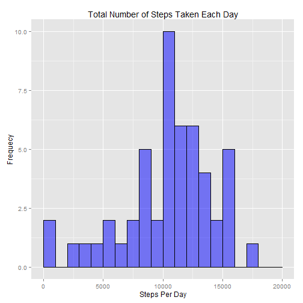
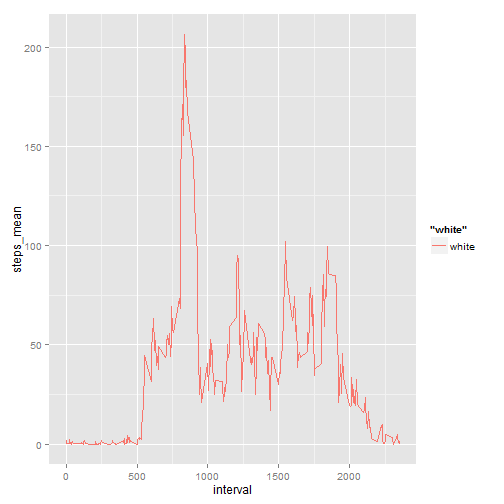
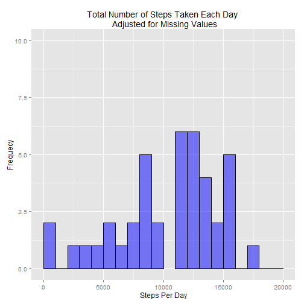
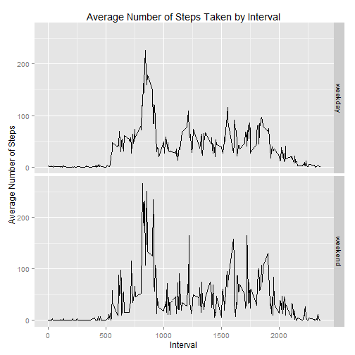

Reproductible Research _ Peer Assignment 1
==========================================

The purpose of this assignment is to analyze data from a personal activity
monitoring device.  The device collects data at 5 minute intervals throughout
the day, and the dataset used for this assignment consists of two months of
data from an anonymous individual collected during the months of October and
November, 2012.  It includes the number of steps taken in 5 minute intervals
each day.

1.Loading and preprocessing the data: load packages that will be used for the 
analysis and read the data into R.


```r
        library(dplyr)
```

```
## 
## Attaching package: 'dplyr'
## 
## The following object is masked from 'package:stats':
## 
##     filter
## 
## The following objects are masked from 'package:base':
## 
##     intersect, setdiff, setequal, union
```

```r
        library(lubridate)
        library(ggplot2)
        library(scales)
        activity <- read.csv("activity.csv", 
        header=TRUE, colClasses=c("integer", "Date", "integer"))
```

2.What is the mean total number of steps taken per day?

        * Calculate the total number of steps taken per day
        

```r
        activity1<- activity %>%
        group_by(date)%>%
        summarise(steps_per_day = sum(steps))
```

        * Make a Histogram of the total number of steps taken per day.
        

```r
        ggplot(data=activity1, aes(activity1$steps_per_day)) + 
        geom_histogram(breaks=seq(0,20000, by=1000), fill="blue", col="black", 
        alpha=.5, density=15)+
        labs(x="Steps Per Day", y="Frequecy")+
        ylim(c(0,10))+
        ggtitle("Total Number of Steps Taken Each Day")
```

 

        * Calculate and report the mean and median of the total number of steps
           taken per day.

```r
        mean(activity1$steps_per_day, na.rm=TRUE)
```

```
## [1] 10766.19
```

```r
        median(activity1$steps_per_day, na.rm=TRUE)
```

```
## [1] 10765
```

The mean of total steps taken per day is 10,766 and the median is 10,765

3.What is the average daily activity pattern?

        * Make a time series plot of the 5-minute interval (x-axis) and the 
          average number of steps taken, averaged across all days (y-axis)
                
                -first find the average number of steps per interval
          

```r
        activity2 <- activity %>%
                group_by(interval)%>%
                summarise(steps_mean=mean(steps, na.rm = TRUE))
```

                - plot the time series graph


```r
        qplot(data=activity2, x=interval, y=steps_mean, 
              color = "white", geom="line")
```

 

                - Which 5-minute interval on average across all the days in the
                  the dataset contains the maximum number of steps?
                  

```r
        activity2[which.max(activity2$steps_mean),]
```

```
## Source: local data frame [1 x 2]
## 
##   interval steps_mean
## 1      835   206.1698
```

Interval 835 contains the maximum number of steps equaling 206

4. Imputing missing values

        *Calculate and reprt the total number of missing values in the dataset
        

```r
        sum(is.na(activity$steps))
```

```
## [1] 2304
```
The activity dataset contains 2,304 missing values

        *Devise a strategy for filling in all the missing values in the
         dataset.  The interval mean is used to replace missing values.
                - First merge the original data with the interval average
                  data.
         

```r
        activity3<- activity%>%
        left_join(activity2, by="interval")
```

                -Create a new column to replace the missing values with the 
                 interval average
                 

```r
        activity3$steps2<- ifelse(is.na(activity3$steps), 
                                  activity3$steps_mean, activity3$steps)
```

                -Remove the original column steps from the database and the 
                 the step_mean column, rename the steps2 column to steps, and
                 create a new dataset that is equal to the original dataset
                 that is equal to the original dataset but with the missing 
                 data filled in.
                 

```r
        activity3$steps <- NULL
        activity3$steps_mean <- NULL
        colnames(activity3) <- c( "date", "interval", "steps")
        activity3 <- activity3[, c(3,1,2)]
```

        *Make a histogram of the total number of steps taken each day and
         calculate and report the mean and median total steps taken per
         day.
         

```r
        activity4 <- activity3 %>%
        group_by(date, na.rm=TRUE) %>%
        summarise(step_day=sum(steps, na.rm=TRUE))
```


```r
        ggplot(data=activity4, aes(activity4$step_day)) + 
        geom_histogram(breaks=seq(0,20000, by=1000), fill="blue", col="black", 
                       alpha=.5)+
        labs(x="Steps Per Day", y="Frequecy")+
        ylim(c(0,10))+
ggtitle("Total Number of Steps Taken Each Day \n Adjusted for Missing Values")
```

 


```r
        mean(activity4$step_day, na.rm=TRUE)
```

```
## [1] 10766.19
```

```r
        median(activity4$step_day, na.rm=TRUE)
```

```
## [1] 10766.19
```

The mean and median derived from the data after the NA values were 
replaced with the interval average are almost identical 
to the mean and median prior to replacing the NA values, 
therefore the impact of replacing the NAs on the mean 
and median are negligible.

5. Are there differences in activity patterns between weekdays and weekends?

        *Create a new factor variable in the dataset with two levels-
         "weekday" and "weekend" indicating whether a given date is a 
         weekday or weekend day.
         

```r
       activity3$daytype <- ifelse(weekdays(activity4$date) %in% 
        c("Saturday", "Sunday"),"weekend", "weekday")
```

        *Make a panel plot containing a time series plot of the 5-minute
         interval(x-axis)and the average number of steps taken, averaged
         across all weekday days or weekend days(y-axis).
         

```r
        activity4 <- activity3 %>%
        group_by(interval, daytype)%>%
        summarise(m_step=mean(steps, na.rm=TRUE))
```


```r
        ggplot(data = activity4, aes(x = interval, y = m_step)) + 
        geom_line() + 
        facet_grid(daytype ~ .) +          
        ggtitle("Average Number of Steps Taken by Interval")+
        labs(x="Interval", y="Average Number of Steps")
```

 

There are differnces between between weekday and weekend intervals. It 
appears from comparing the two graphs that step intervals peak earlier on the
weekend as compared to their peak on weekdays.


